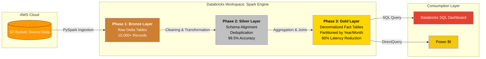

## FMCG Data Consolidation & Analytics Lakehouse

A major retail entity (Atliquon) acquired a smaller competitor (SportsBar). Developed a scalable ETL pipeline to consolidate 10,000+ transactional records into a unified Lakehouse Architecture on AWS S3. The project resolves the critical business challenge of "Data Silos" following a merger, establishing a Single Source of Truth for executive decision-making.

## Technical Architecture & Data Flow
The project follows the Medallion Architecture, ensuring incremental data quality and reliability as records move from raw storage to a business-ready dashboard.

Phase 1: Ingestion & Bronze Layer (The Landing Zone)
- Source Data: Extracted historical transactional data (CSVs) from disparate legacy ERP systems.
- Storage: Loaded raw data into AWS S3 buckets.
- Processing: Used PySpark to ingest these files into Delta Lake format.
- Outcome: Created a persistent audit trail that preserves raw data fidelity for 10,000+ records.

Phase 2: Transformation & Silver Layer (The Quality Engine)
This stage serves as the primary processing hub where inconsistent data is transformed:

- Schema Alignment: Standardized conflicting schemas between the two entities.
- Deduplication: Applied dropDuplicates() on primary keys to prevent double-counting of revenue during the merger transition.
- Validation Gates: Implemented automated cleansing to remove null values and junk records, resulting in 99.5% data accuracy.

Phase 3: Aggregation & Gold Layer (The Analytics Layer)
Designed for high-performance querying and business intelligence:

- Denormalization: Developed wide fact tables by joining dimensions with transactions to eliminate expensive runtime joins.
- Performance Optimization: Utilized Delta Lake partitioning and De-normalization, reducing query latency by 80%.
- Final Serving: Aggregated key metrics such as Combined Sales Performance and Inventory-to-Sales Ratios.

## Tech Stack
Languages: Python (PySpark), SQL.
Tools: Apache Spark (Databricks) for distributed processing.
Storage: Amazon S3 (Data Lake) utilizing Delta Lake format for ACID compliance.
Visualization: Databricks SQL Dashboards for real-time monitoring.

## Key Results & Business Impact
- 75% Faster Time-to-Insight: Replaced manual reporting with a self-service analytics model.
- 10+ Hours Saved Weekly: Automated the reconciliation of a full year of historical data.
- Unified Revenue Reporting: Generated a single dashboard showing a total revenue of 119.93B and 101.11K total customers across both the entities.

## Dashboard Visuals
The end-state of the pipeline is an interactive Databricks Business Analytics dashboard that provides a 360-degree view of the merged company’s health.

